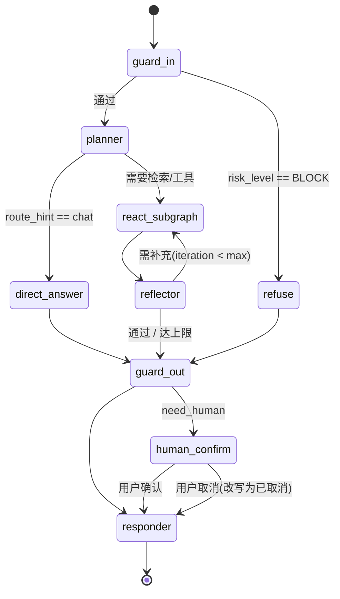

# 03 · LangGraph 状态机与 ReAct 范式

---

## 1. 状态定义 `AgentState`

所有节点签名为 `(AgentState) -> AgentState`（部分字段增量更新），保证可测试、可回放。

| 字段 | 类型 | 说明 |
| --- | --- | --- |
| `trace_id` | str | 全链路追踪 ID |
| `thread_id` | str | 会话线程 ID（Checkpointer 的 key） |
| `user_id_hash` | str | 用户单向哈希，不存明文学号/手机号 |
| `messages` | list[Message] | 对话历史（LangGraph 内置 `add_messages`） |
| `query_raw` | str | 用户原始输入（仅内存中，不落盘） |
| `query_sanitized` | str | 脱敏后输入 |
| `risk_flags` | list[RiskFlag] | 入站护栏产出的风险标记，如 `ALLERGY`、`FOOD_SAFETY`、`INJECTION`、`PII` |
| `route_hint` | str | 入站建议路由：`chat` / `rag` / `tool` / `refuse` |
| `plan` | str | Planner 产出的自然语言计划 |
| `scratchpad` | list[Step] | **ReAct 轨迹**：`{thought, action, action_input, observation, round}` |
| `retrieved_docs` | list[DocChunk] | RAG 召回：`{doc_id, chunk_id, text, score, metadata, source}` |
| `tool_results` | list[SkillResult] | 技能返回（含降级/失败） |
| `degraded` | bool | 本次回答是否使用了降级数据（影响是否需要"以现场为准"提示） |
| `citations` | list[Citation] | 最终引用清单 |
| `draft_answer` | str | Reflector 通过后的草稿 |
| `final_answer` | str | 出站护栏后的终稿 |
| `warnings` | list[str] | 需强制附加的风险提示 |
| `iteration` | int | ReAct 已执行轮次 |
| `max_iterations` | int | 上限，默认 6 |
| `need_human` | bool | 是否等待人工确认（工单场景） |
| `error` | ErrorInfo \| None | 结构化错误 |
| `usage` | TokenUsage | Token 与成本统计 |

---

## 2. 主图结构



### 节点说明

| 节点 | 关键逻辑 | 失败处理 |
| --- | --- | --- |
| `guard_in` | 规则词表 →（可疑时）小模型判定 → PII 脱敏 → 风险分级（PASS / WARN / BLOCK） | 组件异常时**保守放行**并打 `guard_degraded` 标记，同时强制附加风险提示 |
| `planner` | 主模型输出计划与首个 Action；同时决定是否需要用户偏好 | 解析失败 → 重试 1 次 → 退化为"直接检索 + 直接答" |
| `react_subgraph` | ReAct 循环子图（见 §3） | 内部自愈 |
| `reflector` | 校验：① 是否回答了问题；② 硬事实是否有来源；③ 是否违反约束（如过敏原未过滤）；④ 是否需澄清 | 不通过且未达上限 → 回 ReAct 子图并附加批评意见 |
| `guard_out` | 事实一致性核验 + 合规改写 + 风险提示注入 + 引用补全 + 审计 | 核验失败 → 降级为保守回答（只给来源链接 + 人工渠道） |
| `human_confirm` | `interrupt_before` 挂起，等待"确认/修改/取消" | 超时 10 分钟自动取消并告知 |

---

## 3. ReAct 子图（核心）

```
                ┌──────────────┐
                │    reason    │  ← 主模型，输入：system + 历史 + scratchpad
                │  (Thought)   │     输出：Thought + Action + ActionInput
                └──────┬───────┘
                       │ 条件路由 route_by_action
        ┌──────────────┼──────────────┬─────────────────┐
        ▼              ▼              ▼                 ▼
  ┌───────────┐  ┌───────────┐  ┌────────────┐   ┌──────────┐
  │ rag_retrieve│  │ skill_call │  │ ask_clarify│   │  finish  │
  └─────┬─────┘  └─────┬─────┘  └─────┬──────┘   └────┬─────┘
        └──────────────┴──────────────┘               │
                       ▼                              │
                ┌──────────────┐                      │
                │   observe    │ ← 把结果写回 scratchpad│
                └──────┬───────┘                      │
                       ▼                              │
              should_continue? ──是(iteration<N)───────┘
                       │否 / 达上限 / 连续 2 轮同错
                       ▼
                    返回主图
```

### 3.1 三种 Action

| Action | 说明 | 产出 |
| --- | --- | --- |
| `rag_retrieve` | 查 ChromaDB（可指定 collection、metadata 过滤、Top-K） | `retrieved_docs` |
| `skill_call` | 调用已注册技能（**由模型从注册表自主选择**） | `tool_results` |
| `ask_clarify` | 信息不足，向用户追问（如"哪个校区？"） | 中断返回问题 |
| `finish` | 认为信息充分，退出循环 | — |

### 3.2 并行执行

若一轮中模型输出多个**互不依赖**的 Action（例：同时查菜单 + 查人流），`observe` 节点并行执行后合并结果再进入下一轮。

### 3.3 早停与防死循环

| 条件 | 行为 |
| --- | --- |
| `iteration >= max_iterations`（默认 6） | 强制退出，用已获得的信息作答并声明"信息可能不完整" |
| 连续 2 轮同一技能同一参数失败 | 禁止再调用该技能，强制换工具或降级回答 |
| 连续 2 轮 Thought 高度相似（余弦 > 0.92） | 判定陷入循环，强制退出 |
| 单轮 Token 超预算 | 压缩 scratchpad（只保留 action + 结论，丢弃冗长 observation）后继续 |

### 3.4 Observation 的规范化

无论技能成功、降级还是失败，`observe` 都产出**结构化文本**供模型消费，绝不抛异常：

```
[skill=canteen-menu-query] status=DEGRADED code=50410
message=上游菜单服务超时，已使用 60 秒前缓存
data_version=menu_2026-09-08_v3 cached_at=11:42:10
dishes(3): ①香煎鸡胸饭 ¥12 微辣 余量充足 ②…
提示：以下数据非实时，实际以窗口现场为准。
```

---

## 4. 记忆设计

| 层级 | 实现 | 内容 | 生命周期 |
| --- | --- | --- | --- |
| 短期（会话内） | LangGraph Checkpointer（SQLite/Redis） | 最近 N 轮 messages + scratchpad | 会话结束 + 7 天 |
| 中期（会话摘要） | `summarizer` 压缩 | 超长会话压缩为摘要 | 随会话 |
| 长期（用户画像） | Profile Store（Postgres，加密） | 忌口、过敏原、口味、预算、常去食堂 | **需明示授权**，支持一键删除 |

> 过敏原、疾病、宗教饮食属敏感个人信息：写入前必须弹授权卡；未授权时每次会话内临时生效、不落盘。

## 5. 中断与人工确认

- 触发条件：`feedback-ticket` 等写操作技能被调用，或 `risk_flags` 含 `FOOD_SAFETY_INCIDENT`。
- 实现：`interrupt_before=["human_confirm"]`，图挂起并保存 Checkpoint；用户回复后从同一 thread_id 恢复。
- 超时：10 分钟未确认自动取消，告知用户"工单已取消，需要时可重新发起"。

## 6. 错误处理总原则

| 原则 | 说明 |
| --- | --- |
| 不崩溃 | 任何节点异常 → 写入 `state.error` → 路由到 `guard_out` → 输出安全兜底话术 |
| 可降级 | 技能三级降级、RAG 无召回降级、护栏组件异常保守放行 |
| 有痕迹 | 每个降级事件写 `degraded=true` + 原因，最终回答必须向用户披露 |
| 可回放 | Checkpoint 保存完整 state，运营后台可按 trace_id 回放整条 ReAct 轨迹 |
